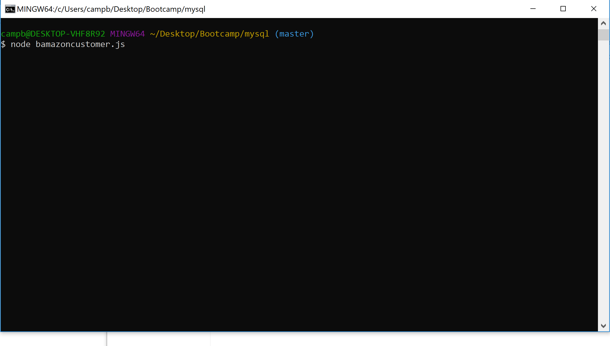
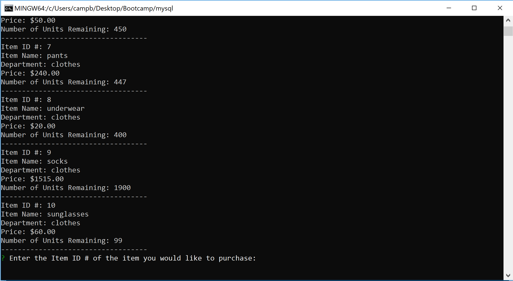
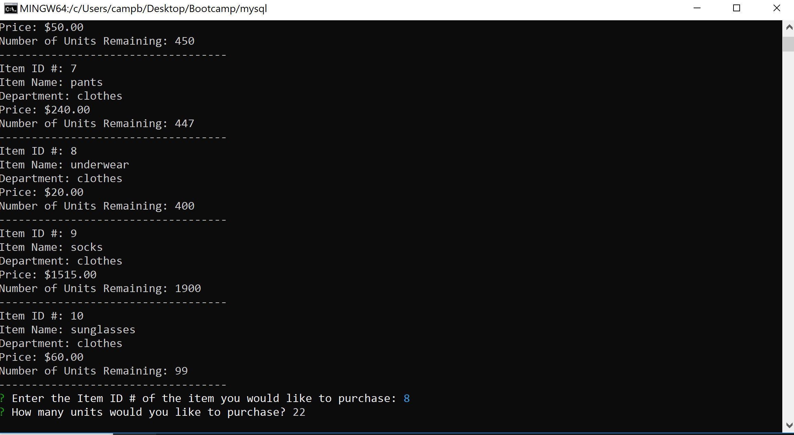
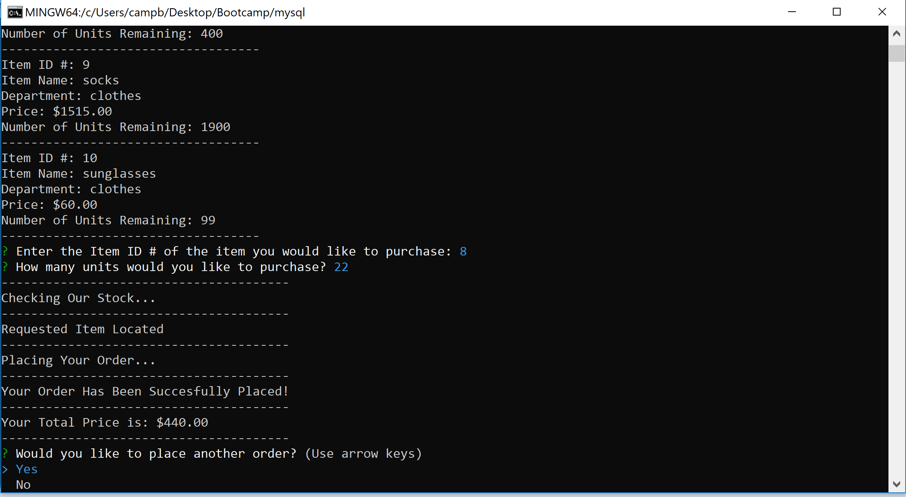
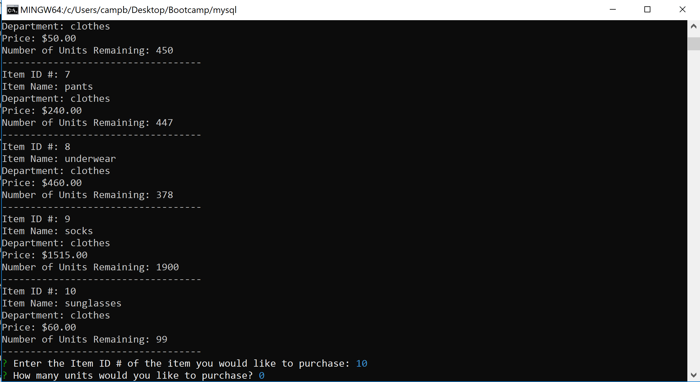
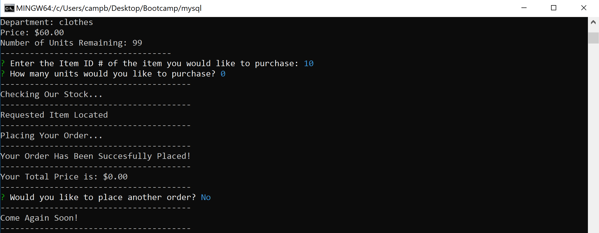

# mysql

First we initialize the document using Node.

We are given a selection of products to purchase.

In this case we will use ID #* (underwear) and purchase 22 of these.

It then asks if we would like to place another order.

If user selects yes it runs the list of products again. Note that ID #8 now says 378 instead of 400. We wont be making an actual purchase here.

If user says No the order closes with a nice little message for the user.

